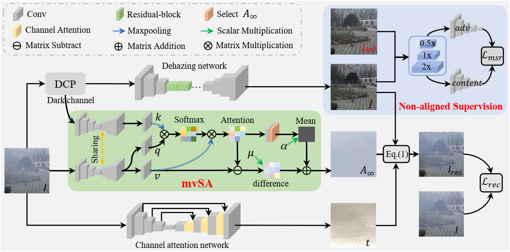
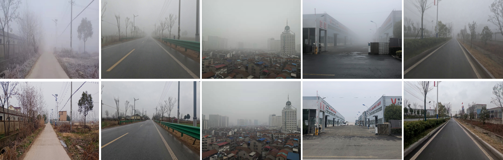

# NSDNet: Non-aligned Supervision for Real Image Dehazing

[Junkai Fan](https://fanjunkai1.github.io/), Fei Guo, Jianjun Qian, [Xiang Li](http://implus.github.io/), [Jun li](https://sites.google.com/view/junlineu/) and Jian Yang

## Video Demo (real-world hazy video)

## Network Architecture

Overall pipeline of our non-aligned supervision framework with physical priors for the real-world image dehazing. It includes the mvSA and non-aligned supervision modules. mvSA can effectively estimate the infinite airlight A∞ in real scenes. 
Our framework is different from the supervised dehazing models as it does not require aligned ground truths.

## Phone-Hazy Dataset

Our phone-hazy dataset contains 415 non-aligned image pairs with four primary scenes: buildings, urban highways, rural cement roads, and outdoor landscapes. The haze levels mainly vary within a visibility range of 0 to 50 meters.

## Our Environment
- Ubuntu 18.04
- Python == 3.9
- PyTorch == 1.11 with CUDA 11.3
- torchvision ==0.12.0
- numpy == 1.22.3)

## Citation
If you are interested in this work, please consider citing:

    @article{fan2023non,
      title={Non-aligned supervision for Real Image Dehazing},
      author={Fan, Junkai and Guo, Fei and Qian, Jianjun and Li, 
          Xiang and Li, Jun and Yang, Jian},
      journal={arXiv preprint arXiv:2303.04940},
      year={2023}
    }

## Acknowledgment
This code is based on the [CycleGAN](https://github.com/junyanz/pytorch-CycleGAN-and-pix2pix). Thank them for their outstanding work.

## Contact
Should you have any question or suggestion, please contact junkai.fan@njust.edu.cn.
