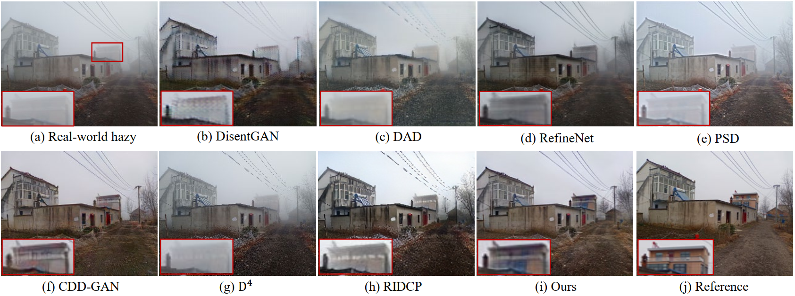

# NSDNet: Non-aligned Supervision for Real Image Dehazing

[Junkai Fan](https://fanjunkai1.github.io/), Fei Guo, [Xiang Li](http://implus.github.io/), Jianjun Qian, [Jun li<sup>*</sup>](https://sites.google.com/view/junlineu/) and Jian Yang<sup>*</sup> <br>
(\* indicates the corresponding author)<br>
PCA Lab, Nanjing University of Science and Technology;

[](https://arxiv.org/pdf/2303.04940v4.pdf)
[](https://fanjunkai1.github.io/projectpage/NSDNet/index.html)

## Video Demo (real-world hazy video)


## Network Architecture


Overall pipeline of our non-aligned supervision framework with physical priors for the real-world image dehazing. It includes the mvSA and non-aligned supervision modules. mvSA can effectively estimate the infinite airlight A∞ in real scenes. 
Our framework is different from the supervised dehazing models as it does not require aligned ground truths.


## Phone-Hazy Dataset


Our phone-hazy dataset contains 415 non-aligned image pairs with four primary scenes: buildings, urban highways, rural cement roads, and outdoor landscapes. The haze levels mainly vary within a visibility range of 0 to 50 meters.

## Results on Smoke Dataset


## Results on Phone-Hazy Dataset



## Results on RTTS Dataset


## 🛠️ Setup
- Ubuntu 18.04
- Python == 3.9
- PyTorch == 1.11 with CUDA 11.3
- torchvision ==0.12.0
- numpy == 1.22.3

## 🎓 Citation
If you are interested in this work, please consider citing:

```bibtex
@article{fan2023non,
  title={Non-aligned supervision for Real Image Dehazing},
  author={Fan, Junkai and Guo, Fei and Qian, Jianjun and Li, Xiang and Li, Jun and Yang, Jian},
  journal={arXiv preprint arXiv:2303.04940},
  year={2023}
}

@inproceedings{fan2024driving,
  title={Driving-Video Dehazing with Non-Aligned Regularization for Safety Assistance},
  author={Fan, Junkai and Weng, Jiangwei and Wang, Kun and Yang, Yijun and Qian, Jianjun and Li, Jun and Yang, Jian},
  booktitle={Proceedings of the IEEE/CVF Conference on Computer Vision and Pattern Recognition},
  pages={26109--26119},
  year={2024}
}
```

## Acknowledgment
This code is based on the [CycleGAN](https://github.com/junyanz/pytorch-CycleGAN-and-pix2pix). Thank them for their outstanding work.

## Contact
If you have any question or suggestion, please contact junkai.fan@njust.edu.cn.
